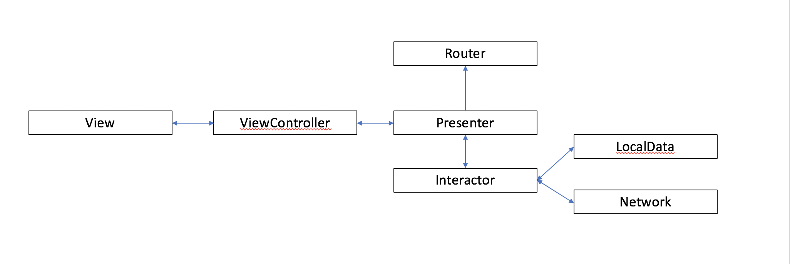

----

# **iTunes App V2**

iOS project for the iTunes API.

This is a ongoing project

## TO-DOS:
* Implement A more complex Detail View
* Implement Search
* Implement More unit tests
* Finish the documentation using DocC
* Implement UI tests
* Implement Error state
* [Implement XcodeGen](https://github.com/yonaskolb/XcodeGen) as default to setup the project
* [Implement SwiftLint](https://github.com/realm/SwiftLint) to implement the automatic code style
* [Implement Fastlane](https://github.com/fastlane/fastlane) to automate the release and unit tests proccess
* [Implement XCodeCloud](https://github.com/apps/xcode-cloud) as the defaul CI/CD tool

## API
<!-- * [Api](https://itunes.apple.com/) -->

## Relevant Links

## iOS Team
* Vinicius Albino

----

# **Architecture VIPER**

# 

----

### Build

Xcode 15.0, iOS 15.0 SDK or later

### Runtime

iOS 15.0 or later
---

# **Style Guide**

# 1. Code Formatting
**1.1** Use **4 spaces** for tabs.

**1.2** Avoid uncomfortably long lines with a hard maximum of **120 characters per line** (Xcode->Preferences->Text Editing->Page guide at column: 120 is helpful for this)

**1.2.1**

**1.3** Always open braces on new lines using **[1TBS style](https://en.m.wikipedia.org/wiki/Indent_style#Variant:_1TBS)**
```swift
class SomeClass {
    func someMethod() {
        if true == false {
            /* code */
        } else if false == true {
            /* code */
        } else {
            /* code */
        }
    }
}
```

**1.4** Dictionary syntax (note that we **left-align** as opposed to aligning colons)
```swift
let userDataDictionary: [String: String] = [
    "name": "Michael",
    "lastName": "Jordan"
]
```

**1.5** In general, there should be a **space** following a comma.
```swift
let myArray = [1, 2, 3, 4, 5]
```

**1.6** There should be a **space** before and after a binary operator such as +, ==, or ->.
```swift
let myValue = 20 + (30 / 2) * 3

if 1 + 1 == 3 {
    fatalError("The universe is broken.")
}
```

**1.7** Follow Xcode's recommended **indentation style** (i.e. your code should not change if CTRL-I is pressed). When declaring a function that **spans multiple lines**, prefer using that syntax to which Xcode, as of version 11.0, defaults.
```swift
func myFunctionWithManyParameters(parameterOne: String,
                                  parameterTwo: Int,
                                  parameterThree: Bool) {
    // Xcode indents to here for this kind of statement
    print("\(parameterOne) \(parameterTwo) \(parameterThree)")
}
```

**1.8** When calling a function that has many parameters, put each **argument on a separate line** with a single extra indentation.
```swift
myFunctionWithManyParameters(parameterOne: "Hello, I am a string",
                             parameterTwo: 10,
                             parameterThree: true)
```

**1.9** Prefer using local constants or other mitigation techniques to **avoid multi-line predicates** where possible.
```swift
func firstReallyReallyLongPredicateFunction() -> Bool {
    return true
}

func secondReallyReallyLongPredicateFunction() -> Bool {
    return false
}

func thirdReallyReallyLongPredicateFunction() -> Bool {
    return true
}

let firstCondition = firstReallyReallyLongPredicateFunction()
let secondCondition = secondReallyReallyLongPredicateFunction()
let thirdCondition = thirdReallyReallyLongPredicateFunction()

if firstCondition && secondCondition && thirdCondition {
    // do something
}
```

----

# 2. Naming

 **2.1** Use **```struct```** over classes whenever possible.

 **2.2** The **```self```** keyword is only used in closures and namespace conflicts.
```swift
struct CustomAlertView {
    var message: String
    let messageLabel = UILabel()

    init(message: String) {
        self.message = message
    }

    func showAlert() {
        self.messageLabel.text = message
    }
}
```

 **2.3** Use **PascalCase** for type names (e.g. ```struct```, ```enum```, ```class```, ```typedef```, ```associatedtype```, etc.).

 **2.4** Use **camelCase** (initial lowercase letter) for ```function```, ```method```, ```property```, ```constant```, ```variable```, ```argument names```, ```enum cases```, etc.).

 **2.5** **Names** should be **descriptive** and unambiguous.
```swift
// PREFERRED
class RoundAnimatingButton: UIButton { /* code */ }

// NOT PREFERRED
class CustomButton: UIButton { /* code */ }
```

 **2.6** **Do not abbreviate**, use shortened names, or single letter names.
```swift
// PREFERRED
let animationDuration: TimeInterval
let error: Error

// NOT PREFERRED
let aniDur: TimeInterval
let er: Error
```

 **2.7** Use the **specific type** in classes, properties or outlets names, use ```ViewController``` instead of ```Controller```
```swift
// PREFERRED
let loginViewController: UIViewController
let productsTableViewController: UITableViewController
weak var firstNameLabel: UILabel!
weak var submitButton: UIButton!

// NOT PREFERRED
let loginController: UIViewController
let productsTableController: UITableViewController
weak var lblFirstName: UILabel!
weak var btnSubmit: UIButton!
```

 **2.8** When naming function arguments, make sure that the function can be **read easily** to understand the **purpose** of each argument.

 **2.9** As per **[Apple's API Design Guidelines](https://swift.org/documentation/api-design-guidelines/)**, a protocol should be named as nouns if they describe what something is doing (e.g. Collection) and using the **suffixes able, ible, or ing if it describes a capability** (e.g. Equatable, ProgressReporting). If neither of those options makes sense for your use case, you can add a **Protocol suffix to the protocol's name as well**. Some example protocols are below.
```swift
// here, the name is a noun that describes what the protocol does
protocol TableViewSectionProvider {
    func rowHeight(at row: Int) -> CGFloat
    var numberOfRows: Int { get }
    /* code */
}

// here, the protocol is a capability, and we name it appropriately
protocol Loggable {
    func logCurrentState()
    /* code */
}

// suppose we have an `InputTextView` class, but we also want a protocol
// to generalize some of the functionality - it might be appropriate to
// use the `Protocol` suffix here
protocol InputTextViewProtocol {
    func sendTrackingEvent()
    func inputText() -> String
    /* code */
}
```

 **2.10** **Only** create components with the nomenclature **Object** for classes that have the purpose to convert an **Entity in a RealmObject**.

 **2.11** Use the following **convention** for classes **nomenclature**:

                  ViewController: ExampleViewController
                      View Model: ExampleViewModel
                        Delegate: ExampleDelegate
     Abstract Service (protocol): ExampleRemoteService
        Abstract Service (local): ExampleLocalService
       Concrete Service (remote): ExampleRequest
        Concrete Service (local): ExampleStorage
                     Fill Struct: ExampleDTO
           Encapsulated (entity): Example
         Local DB Object (Realm): ExampleObject

----

# 3. Coding Style

**3.1** Prefer **let** to var whenever possible.

**3.2** Prefer **not declaring types** for constants or variables **if they can be inferred** anyway.

**3.3** Prefer the composition of **map, filter, reduce, etc.** over iterating when transforming from one collection to another. Make sure to avoid using closures that have side effects when using these methods.
```swift
// PREFERRED
let preferredStringOfInts = [1, 2, 3].flatMap { String($0) } // ["1", "2", "3"]

// NOT PREFERRED
var notPreferredStringOfInts: [String] = []
for integer in [1, 2, 3] {
  notPreferredStringOfInts.append(String(integer))
}

// PREFERRED
let preferredEvenNumbers = [4, 8, 15, 16, 23, 42].filter { $0 % 2 == 0 } // [4, 8, 16, 42]

// NOT PREFERRED
var notPreferredEvenNumbers: [Int] = []
for integer in [4, 8, 15, 16, 23, 42] {
  if integer % 2 == 0 {
    notPreferredEvenNumbers.append(integer)
  }
}
```

**3.4** If a **function returns multiple values**, prefer returning a tuple to using inout arguments (it’s best to **use labeled tuples** for clarity on what you’re returning if it is not otherwise obvious). If you use a certain tuple **more than once, consider using a typealias**. If you’re **returning 3 or more items** in a tuple, consider using a **struct or class** instead.
```swift
func playerName() -> (firstName: String, lastName: String) {
  return ("Michael", "Jordan")
}

let name = playerName()
let firstName = name.firstName
let lastName = name.lastName
```

**3.5** Be wary **of retain cycles** when creating delegates/protocols for your classes; typically, these properties should be declared **weak**.

**3.6** Be careful when calling **self** directly from an escaping closure as this **can cause a retain cycle** - use a **[capture list](https://developer.apple.com/library/content/documentation/Swift/Conceptual/Swift_Programming_Language/Closures.html#//apple_ref/doc/uid/TP40014097-CH11-XID_163)** when this might be the case:

**3.7** Prefer use **if ternary** when possible to avoid a verbose code.

**3.8** Avoid some kind of code or verifications that **Swift already provide**, like use ```String.isEmpty``` instead of testing it's lenght like ```String.characters.count > 0```.
```swift
func checkSomeCondition() -> Bool {
  return true
}

let someString = checkSomeCondition() ? "ABC" : "123"

// NOT PREFERRED
var booleanFlag = someString.isEmpty

// PREFERRED
booleanFlag = someString.characters.count > 0
```

**3.9** When using a statement such as ```else```, ```catch```, etc. that follows a block, put this keyword on the **same line as the block**. Again, we are following the **[1TBS style](https://en.m.wikipedia.org/wiki/Indent_style#Variant:_1TBS)** style here.

**3.10** Don't place **parentheses** around control flow predicates.
```swift
// PREFERRED
if true == false {
  /* code */
} else {
  /* code */
}

// NOT PREFERRED
if (true == false) {
  /* code */
}
else {
  /* code */
}
```

**3.11** Avoid writing out an **enum type** where possible - use **shorthand**.
```swift
// PREFERRED
let preferredColor: UIColor = .white

// NOT PREFERRED
let notPreferredColor: UIColor = UIColor.white
```

**3.12** Prefer ```static``` to ```class``` when declaring a function or property that is associated with a class as opposed to an instance of that class. Only use ```class``` if you specifically need the functionality of overriding that function or property in a subclass, though consider using a ```protocol``` to achieve this instead.

**3.13** If you have a function that takes no arguments, has no side effects, and returns some object or value, prefer using a computed property instead.

**3.14** For the purpose of namespacing a set of ```static``` functions and/or ```static``` properties, prefer using a caseless ```enum``` over a ```class``` or a ```struct```. This way, you don't have to add a ```private init() { }``` to the container.


**3.15** If specifying a closure as a type, you don’t need to wrap it in parentheses unless it is required (e.g. if the type is optional or the closure is within another closure). Always wrap the arguments in the closure in a set of parentheses - use () to indicate no arguments and use Void to indicate that nothing is returned.
```swift
let firstCompletionBlock: (Bool) -> Void = { success in
  print("Success? \(success)")
}

let secondCompletionBlock: () -> Void = {
  print("Completed!")
}

let thirdCompletionBlock: (() -> Void?)? = nil
```

**3.16** If the types of the parameters are obvious, it is OK to omit the type name, but being explicit is also OK. Sometimes readability is enhanced by adding clarifying detail and sometimes by taking repetitive parts away - use your best judgment and be consistent.
```swift
func closureWithCompletion(completion: (String?) -> Void) { }

closureWithCompletion { text in
  print("handle text \(text)")
}
```

**3.17** Use Swift native types whenever possible.

**3.18** When briding, create and extensions that decouples the process from the implementation.
```swift
let width = 120.0

extension Double {
  func toString() -> String {
    return (width as NSNumber).stringValue
  }
}

let widthString = width.toString()
```

----

# 4. Switch and Enums

**4.1** Remember to use **camelCase** to declare enums cases.

**4.2** When using a switch statement that has a **finite** set of possibilities (```enum```), do **NOT** include a ```default``` case. Instead, place unused cases at the bottom and use the ```break``` keyword to prevent execution.

**4.3** Prefer **lists of possibilities** (e.g. ```case 1, 2, 3:```) to using the ```fallthrough``` keyword where possible).

**4.4** Since switch cases in **Swift break by default**, do not include the break keyword if it is not needed.

**4.5** The ```case``` statements should line up with the ```switch``` statement itself as per default Swift standards.

**4.6** When defining a case that has an associated value, make sure that this value is appropriately labeled as opposed to just types (e.g. ```case Hunger(hungerLevel: Int)``` instead of ```case Hunger(Int)```).
```swift
enum Problem {
   case attitude
   case hair
   case hunger(hungerLevel: Int)
}

func handleProblem(problem: Problem) {
   switch problem {
   case .attitude:
       print("At least I don't have a hair problem.")
   case .hair:
       print("Your barber didn't know when to stop.")
   case .hunger(let hungerLevel):
       print("The hunger level is \(hungerLevel).")
   }
}

enum CompassPoint {
   case north
   case south
   case east
   case west
}

let northDirection: CompassPoint = .north
let southDirection = CompassPoint.south
```

----

# 5. Optionals and Guard

**5.1** **Always avoid** (except in rare cases discussed and agreed with the team) using **implicitly unwrapped optionals**, it is better to use a non-optional or regular optional property. Yes, there are cases in which you can probably "guarantee" that the property will never be nil when used, but it is better to be **safe and consistent**. Similarly, don't use force unwraps.

**5.2** If you don't plan on actually using the value stored in an optional, but need to determine whether or not this value is nil, explicitly **check this value against nil as opposed to using if let syntax**.
```swift
var someOptional: String? {
    return "String value"
}

// PREFERERED
if someOptional != nil {
    // do something
}

// NOT PREFERRED
if let _ = someOptional {
    // do something
}
```

**5.3** **Don't use ```unowned```**. You can think of ```unowned``` as somewhat of an equivalent of a **```weak```** property that is implicitly unwrapped (though unowned has slight performance improvements on account of completely ignoring reference counting). Since we don't ever want to have implicit unwraps, we similarly don't want unowned properties.
```swift
// PREFERRED
weak var parentViewController: UIViewController?

// NOT PREFERRED
weak var unwrapedParentViewController: UIViewController!
unowned var unownedParentViewController: UIViewController
```

**5.4** When **unwrapping optionals**, use the **same name** for the unwrapped constant or variable where appropriate.

**5.5** When unwrapping optionals, **prefer ```guard``` statements as opposed to ```if``` statements** to decrease the amount of nested **indentation** in your code.
```swift
// PREFERRED
func preferredGuardStatement() {
    guard let someOptional = someOptional else {
        return
    }
    print("handle \(someOptional)")
}

// NOT PREFERRED
func notPreferredGuardStatement() {
    if let someOptional = someOptional {
        print("handle \(someOptional)")
    }
}

// EVEN LESS PREFERRED
func evenLessPreferredGuardStatement() {
    if someOptional == nil {
        return
    }
    print("handle \(someOptional)")
}
```

**5.6** In general, prefer to use an **"early return" strategy** where applicable as opposed to nesting code in if statements. Using guard statements for this use-case is often helpful and can improve the **readability** of the code.
```swift
let colors = ["red", "blue", "yellow"]

// PREFERRED
func preferredUseColor(at index: Int) {
    guard index >= 0 && index < colors.count else {
        // return early because the index is out of bounds
        return
    }

    let color = colors[index]
    print("handle color \(color)")
}

// NOT PREFERRED
func notPreferredUseColor(at index: Int) {
    if index >= 0 && index < colors.count {
        let color = colors[index]
        print("handle color \(color)")
    }
}
```

**5.7** When deciding **between using an ```if``` statement or a ```guard``` statement** when unwrapping optionals is not involved, the most important thing to keep in mind is the **readability of the code**. There are many possible cases here, such as depending on two different booleans, a complicated logical statement involving multiple comparisons, etc., so in general, use your best judgement to write code that is readable and consistent. If you are unsure whether ```guard``` or ```if``` is more readable or they seem equally readable, prefer using ```guard```.
```swift
let someBoolValue = true

func usingIfStatement() {
    // an `if` statement is readable here
    if someBoolValue {
        return
    }
}

func usingGuardStatement() {
    // a `guard` statement is readable here
    guard someBoolValue else {
        return
    }
}

func usingGuardAndNegativeStatement() {
    // double negative logic like this can get hard to read - i.e. don't do this
    guard !someBoolValue else {
        return
    }
}
```

**5.8** You should also use **guard only if a failure should result in exiting the current context**. Below is an example in which it makes more sense to use two if statements instead of using two guards - we have two unrelated conditions that should not block one another.
```swift
let personTupleExample: (name: String?, phone: String?) = ("John", nil)

if let name = personTupleExample.name {
    print("handle name \(name)")
}

if let phone = personTupleExample.phone {
    print("handle phone \(phone)")
}
```

**5.9** Often, we can run into a situation in which we need to **unwrap multiple optionals** using ```guard``` statements. In general, combine unwraps into a single guard statement if handling the failure of each unwrap is identical (e.g. just a ```return, break, continue, throw```, or some other ```@noescape```).
```swift
let addressTupleExample: (street: String?, number: String?) = ("Broadway Avenue", "222")

func combinedGuardStatements() {
    // combined because we just return
    guard let street = addressTupleExample.street, let number = addressTupleExample.number else {
        return
    }
    print("handle street \(street)")
    print("handle number \(number)")
}

func separatedGuardStatements() {
    // separate statements because we handle a specific error in each case
    guard let street = addressTupleExample.street else {
        print("handle street error")
        return
    }

    guard let number = addressTupleExample.number else {
        print("handle number error")
        return
    }

    print("handle street \(street)")
    print("handle number \(number)")
}
```
**5.10** Don’t use **one-liners** for guard statements.
```swift
func linesForGuardStatement() {
    // PREFERRED
    guard let street = addressTupleExample.street else {
        return
    }

    // NOT PREFERRED
    guard let number = addressTupleExample.number else { return }

    print("handle street \(street)")
    print("handle number \(number)")
}
```

**5.11** Use the extensions ```createCell()``` for UITableViewCell and UICollectionViewCell. These extensions already have the SwiftLint commands ```// swiftlint:disable force_cast``` and ```// swiftlint:enable force_cast``` to ignore the check style warning about (our well-know) cell force cast.
```swift
override func tableView(_ tableView: UITableView, cellForRowAt indexPath: IndexPath) -> UITableViewCell {
  // PREFERRED
  let cell: DepartmentTableViewCell = UITableViewCell.createCell(tableView: tableView)
  cell.fill()
  return cell

  // NOT PREFERRED
  let cell = tableView.dequeueReusableCell(withIdentifier: "DepartmentTableViewCell") as! DepartmentTableViewCell
  cell.fill()
  return cell
}

override func collectionView(_ collectionView: UICollectionView, cellForItemAt indexPath: IndexPath) -> UICollectionViewCell {
  // PREFERRED
  let cell: ProductCell = UICollectionViewCell.createCell(collectionView: collectionView, indexPath: indexPath)
  cell.fill()
  return cell

  // NOT PREFERRED
  let cell = collectionView.dequeueReusableCell(withReuseIdentifier: "ProductColorCollectionViewCell", for: indexPath) as! ProductColorCollectionViewCell
  cell.fill()
  return cell
}
```

**5.12** We also should use the extension ```fromNib()``` for our component views (the views are filled inside our cells). This extension also has the SwiftLint commands ```// swiftlint:disable force_cast``` and ```// swiftlint:enable force_cast``` to ignore the check style warning about (our well-know) cell force cast.
```swift
class ComponentTableViewCell: UITableViewCell {
  // PREFERRED
  let view: ComponentView = UIView.fromNib()

  // NOT PREFERRED
  let view = Bundle.main.loadNibNamed("ComponentView", owner: nil, options: nil)!.first as! ComponentView

  fillWithSubview(subview: view)
}
```
----

# 6. Properties and Arrays

**6.1** If making a **read-only**, computed property, provide the **getter without the ```get {}```** around it.
```swift
let someCondition = true

var readableProperty: String {
   if someCondition {
       return "Value for a satisfy condition"
   }
   return "Default value"
}
```

**6.2** When using ```get {}```, ```set {}```, ```willSet```, and ```didSet```, **indent these blocks**.

**6.3** Though you can create a custom name for the new or old value for willSet/didSet and set, use the standard newValue/oldValue identifiers that are provided by default.
```swift
var storedProperty: String = "I'm selling these fine leather jackets." {
   willSet {
     print("will set to \(newValue)")
   }
   didSet {
     print("did set from \(oldValue) to \(storedProperty)")
   }
}

var computedProperty: String  {
   get {
       if someCondition {
           return "I'm a mighty pirate!"
       }
       return storedProperty
   }
   set {
       storedProperty = newValue
   }
}
```

**6.4** In general, **avoid accessing an array directly with subscripts**. When possible, use accessors such as **```.first```** or **```.last```**, which are optional and won’t crash.
```swift
let devicesArray = ["iPhone", "iPad", "iMac", "MacBook"]
let firstObject = devicesArray.first
let lastObject = devicesArray.last
```

**6.5** Prefer using a for **item in items** syntax when possible. You also can use ```for (index, value) in items.enumerated()``` to get both the **index** and the **value**.
```swift
// PREFERRED
for device in devicesArray {
   print("handle device \(device)")
}

for (index, device) in devicesArray.enumerated() {
   print("handle index \(index)")
   print("handle device \(device)")
}

// NOT PREFERRED
for i in 0 ..< devicesArray.count {
   let device = devicesArray[i]
   print("handle index \(i)")
   print("handle device \(device)")
}
```

**6.6** **Never use** the ```+=``` or ```+``` operator to append/concatenate to arrays. Instead, **use ```.append()``` or ```.append(contentsOf:)```** as these are far more performant (at least with respect to compilation) in Swift's current state.

----

# 7. Fill and DTOs

**7.1**  Create **```fill``` functions** to transfer the data from business class (ViewModel) to the UI component (UIView, UITableViewCell, UICollectionViewCell, etc.).

**7.2** Create **```structs``` as DTOs (Data Transfer Object)** to provide all the necessary data that you want to show in your **UI** (the UI just receive and present the informations of the struct created in business class, like the ViewModel).
```swift
struct UserProfileDTO {
    var userName = ""
    var userPhone = ""
    var userEmail = ""
}

class UserProfileView: UIView {

    @IBOutlet var userNameLabel: UILabel!
    @IBOutlet var userPhoneLabel: UILabel!
    @IBOutlet var userEmailLabel: UILabel!

    func fill(dto: UserProfileDTO) {
        userNameLabel.text = dto.userName
        userPhoneLabel.text = dto.userPhone
        userEmailLabel.text = dto.userEmail
    }
}
```

**7.3** Prefer create **```structs```** using **```Equatable```** protocol, it must requires an implementation of the **```==```** operator function to compare and validate the properties from the struct, and also provide a easy way to validate the data in Unit Tests for example.
```swift
struct PaymentDTO: Equatable {
    var totalPrice = ""
    var discountPrice = ""
    var installmentsAmount = ""
    var installmentsValue = ""
}

func == (lhs: PaymentDTO, rhs: PaymentDTO) -> Bool {
    return lhs.totalPrice == rhs.totalPrice &&
           lhs.discountPrice == rhs.discountPrice &&
           lhs.installmentsAmount == rhs.installmentsAmount &&
           lhs.installmentsValue == rhs.installmentsValue
}
```

----

# 8. Snippets and Marks

**8.1** Prefer use **Code Snippets** to maintain a standardization and create a pattern of code. Many business and UI classes have the same structure and code in common, an easy and fast way to reuse this code always with the same strucuture it's using the Snippets provide by the X-Code or create your own.

**8.2** To centralize the Snippets files, create and keep them at Resources folder (localized in this playground file > Resources > Snippets). Any doubts about how to create, update or copy existing snippets, take a look at README file with all the instructions, localized at the same folder.

**8.3** Always update the **Code Snippets** folder (localized in this playground file > Resources > Snippets) when create a new one and notify the team.

**8.4** Use **```MARKs```** anotations to organize the functions, improve a good reading and understanding of the class.
```swift
// MARK: Private properties

private let pi = 3.14
private let color = UIColor.red
private let view: UIView?

// MARK: Private functions

private func doSomething() { }

private func doSomeValidation() { }

// MARK: Tracking functions

func trackScreenName() { }

func trackUserInteraction() { }
```
---

# 9. Comments and Documentation

**9.1** Use Swift’s [dialect of Markdown](https://developer.apple.com/library/archive/documentation/Xcode/Reference/xcode_markup_formatting_ref/).

**9.2** Begin with a summary that describes the entity being declared. Often, an API can be completely understood from its declaration and its summary.

**Focus on the summary**; it’s the most important part. Many excellent documentation comments consist of nothing more than a great summary.

**Use a single sentence fragment** if possible, ending with a period. Do not use a complete sentence.

**Describe what a function or method does and what it returns**, omitting null effects and Void returns:
```swift
 /// Inserts `newHead` at the beginning of `self`.
mutating func prepend(_ newHead: Int)

/// Returns a `List` containing `head` followed by the elements
/// of `self`.
func prepending(_ head: Element) -> List

/// Removes and returns the first element of `self` if non-empty;
/// returns `nil` otherwise.
mutating func popFirst() -> Element?
```

**Optionally, continue** with one or more paragraphs and bullet items. Paragraphs are separated by blank lines and use complete sentences.

```swift
/// Writes the textual representation of each    ← Summary
/// element of `items` to the standard output.
///                                              ← Blank line
/// The textual representation for each item `x` ← Additional discussion
/// is generated by the expression `String(x)`.
///
/// - Parameter separator: text to be printed    ⎫
///   between items.                             ⎟
/// - Parameter terminator: text to be printed   ⎬ Parameters section
///   at the end.                                ⎟
///                                              ⎭
/// - Note: To print without a trailing          ⎫
///   newline, pass `terminator: ""`             ⎟
///                                              ⎬ Symbol commands
/// - SeeAlso: `CustomDebugStringConvertible`,   ⎟
///   `CustomStringConvertible`, `debugPrint`.   ⎭
public func print(
  _ items: Any..., separator: String = " ", terminator: String = "\n")
```

**9.3 Use Markdown**
**Use recognized** [symbol documentation markup](https://developer.apple.com/library/archive/documentation/Xcode/Reference/xcode_markup_formatting_ref/SymbolDocumentation.html#//apple_ref/doc/uid/TP40016497-CH51-SW13) elements to add information beyond the summary, whenever appropriate.
